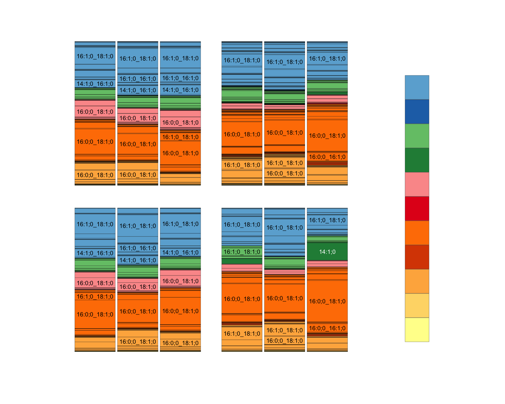
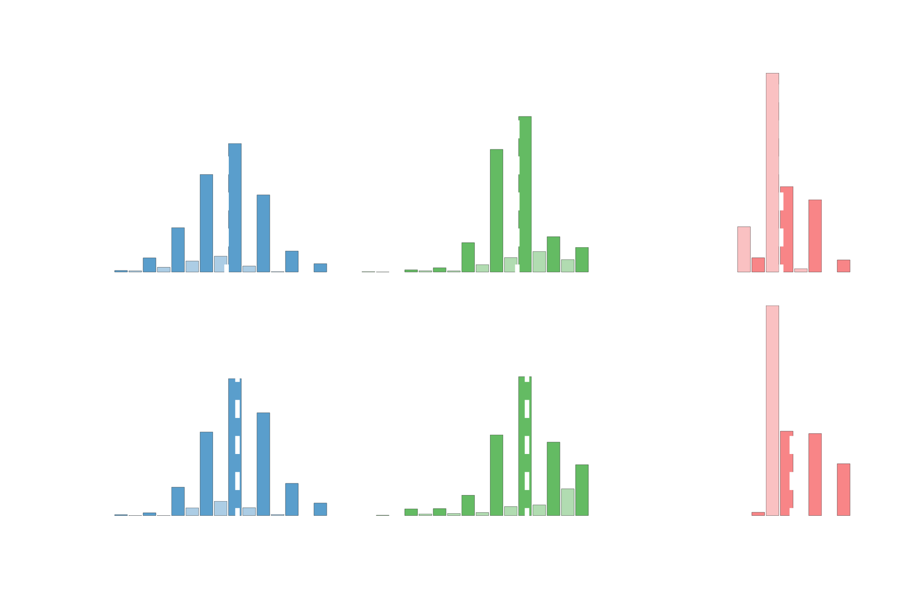

# seelipids

Making patterns visible in complex lipidomic data.

  
   

This repo contains R code for digesting data from [LIPID MAPS](https://www.ucsd-lipidmaps.org/) and [LipoType](https://www.lipotype.com/) glycerophospholipid analyses and visualizing them with barplots.

## How to use

This repo contains two "fully worked" examples: one each starting from LIPID MAPS and LipoType data. The parsing and plotting scripts are documented internally.

**For routine use you can clone the repo and replace the [raw data files](https://github.com/octopode/seelipids/tree/main/01-rawdata) with your own.**

Once your datafiles are in place, open `seelipids.RProj`.

0. Run `parse_lipidmaps.R` or `parse_lipotype.R` to get your data into a [tidy format](https://cran.r-project.org/web/packages/tidyr/vignettes/tidy-data.html). These scripts save a tidy long-format TSV that the plotting scripts load in so you don't have to re-parse the raw data every time you revisit your project.

If the data loads successfully, the script should print a simple report to the console, e.g.:
`Found 2392 compounds in 35 samples`.
Make sure your sample count is correct!

1. Create a metadata spreadsheet in Google Sheets, Excel, etc. and save it as TSV. One column, called `eid` (Extract ID) should contain unique sample identifiers and the other columns can contain any metadata you like. Metadata columns in the [example data](https://github.com/octopode/seelipids/tree/main/01-rawdata) include `sp`, `strain`, `depth`, `temp`, `press`, etc.

2. Take a look in the [`04-pdf`](https://github.com/octopode/seelipids/tree/main/04-pdf) directory for some examples of plots you can make. You can track down the code for each plot by searching for the filename within the `plot_*.R` scripts. The code above the `ggsave()` call pointing to that filename generates the plot.

3. Copy the code block for the plot closest to what you want and hack it up.

With a knack for [ggplot2 syntax](https://github.com/rstudio/cheatsheets/blob/master/data-visualization-2.1.pdf), you can customize the two precooked plotting styles `gg_headgp()` and `gg_acylchain()` quite a bit.

The `chroma*` vectors in `seelipids_helpers.R` will allow you to customize headgroup color mapping.

If you want something else, e.g. a box-and-whisker plot or a non-stacked barplot with error bars, the long-format dataframes are ready to be fed into your own `ggplot()` calls. Sky's the limit!

### Debugging tips

0. It is recommended to keep an unmodified version of the repo so you can verify that example plots can be reproduced on your system and so that errors caused by modifying the example scripts can be isolated.

1. Lipidomics services tend to make minor changes in datafile formatting over time, which can cause parsing errors. Some parameters to look at and tweak if your raw data fails to parse:

- Argument `skip =`: the number of rows to skip at the beginning of a datasheet. These often contain unformatted notes and comments.

- `cols_meta_ltyp`: list of the metadata columns provided by LipoType. If they remove or change any of these names, `parse_lipotype.R` will try to handle the metadata as mole percentages and there will be trouble. Make sure it captures all the metadata columns in _your_ files!

> Feel free to open an issue if you cannot get your data into tidy format.

## License

 This work is licensed under a <a rel="license" href="http://creativecommons.org/licenses/by-nc-sa/4.0/">Creative Commons Attribution-NonCommercial-ShareAlike 4.0 International License</a>.